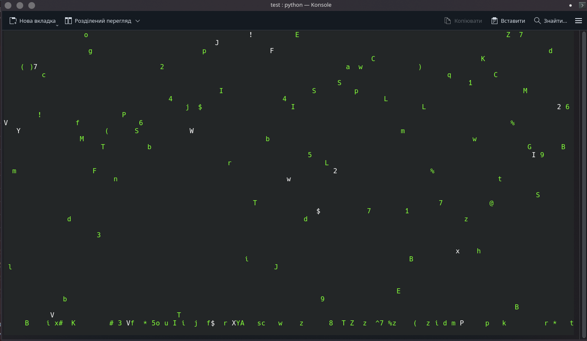

# Matrix-effect

A Python implementation of the iconic Matrix digital rain effect using curses library.



## Features

- Random falling characters similar to The Matrix movie
- Green terminal text with occasional white highlighted characters
- Adjustable speed and appearance
- Press 'q' to quit

## Installation

```bash
# For Windows users may need:
pip install windows-curses
